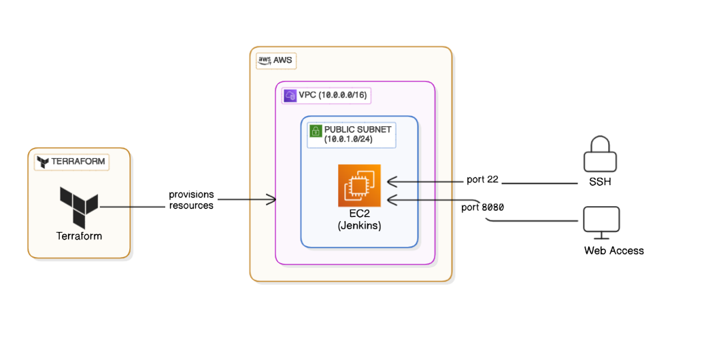

# Terraform AWS Jenkins Server Deployment

This project uses Terraform to automate the deployment of a Jenkins server on an Amazon EC2 instance within a public subnet of a Virtual Private Cloud (VPC). The setup includes configuring the VPC, subnet, Internet Gateway, security group, and user data script to install Jenkins.

## Table of Contents
1. [Overview](#overview)
2. [Architecture](#architecture)
3. [Prerequisites](#prerequisites)
4. [Setup Instructions](#setup-instructions)
5. [Usage](#usage)
6. [Outputs](#outputs)
7. [Contributing](#contributing)

---

## Overview
This project automates the deployment of a Jenkins server on an Amazon EC2 instance using Terraform. It creates a complete infrastructure setup, including a Virtual Private Cloud (VPC), public subnet, Internet Gateway, security group, and the EC2 instance itself. The Jenkins server is installed and configured automatically via a user data script, allowing you to quickly set up a CI/CD environment in the AWS cloud.

With this project, you can:

Deploy a fully functional Jenkins server with minimal manual effort.
Customize the infrastructure by modifying Terraform variables.
Ensure secure access through properly configured security groups.
---

## Architecture

The architecture of this project consists of the following components:

- **Terraform**: Automates the provisioning of AWS resources.
- **VPC**: A logically isolated virtual network in AWS.
- **Public Subnet**: Allows the EC2 instance to communicate with the internet.
- **Internet Gateway**: Provides access to the internet for the VPC.
- **EC2 Instance**: Runs the Jenkins server.
- **Security Group**: Controls inbound and outbound traffic to the EC2 instance.

  

---

## Prerequisites

Before deploying this project, ensure you have the following:

1. **AWS Account**: An active AWS account with appropriate permissions.
2. **Terraform Installed**: Install Terraform from [here](https://www.terraform.io/downloads.html).
3. **AWS CLI Configured**: Configure your AWS credentials using the AWS CLI:
   ```bash
   aws configure
   ```
4. **SSH Key Pair**: Create or use an existing SSH key pair in AWS to access the EC2 instance.

---

## Setup Instructions

1. **Clone the Repository**:
   ```bash
   git clone https://github.com/godcandidate/terraform_projects/
   cd jenkins-server
   ```

2. **Update Variables**:
   - Open `terraform.tfvars` and update the variables such as `aws_region`, `key_name`, and `ssh_access_cidr`.

3. **Initialize Terraform**:
   ```bash
   terraform init
   ```

4. **Plan the Deployment**:
   ```bash
   terraform plan
   ```

5. **Apply the Configuration**:
   ```bash
   terraform apply
   ```
   Confirm the changes by typing `yes` when prompted.

---

## Usage

Once the deployment is complete, Terraform will output the public IP address of the Jenkins server. Use this IP to access Jenkins in your browser:

```
http://<public-ip>:8080
```

To log in to Jenkins, retrieve the initial admin password from the EC2 instance:

```bash
sudo cat /var/lib/jenkins/secrets/initialAdminPassword
```

---

## Outputs

After running `terraform apply`, the following outputs will be displayed:

- **Jenkins Instance Public IP**: The public IP address of the Jenkins server.


Example:
```plaintext
Outputs:

jenkins_instance_public_ip = "34.201.123.45"
```

---

## Contributing

 Contributions are welcome! If you find any issues or want to enhance this project, feel free to open an issue or submit a pull request.

---

## License

This project is licensed under the [MIT License](LICENSE).

---
