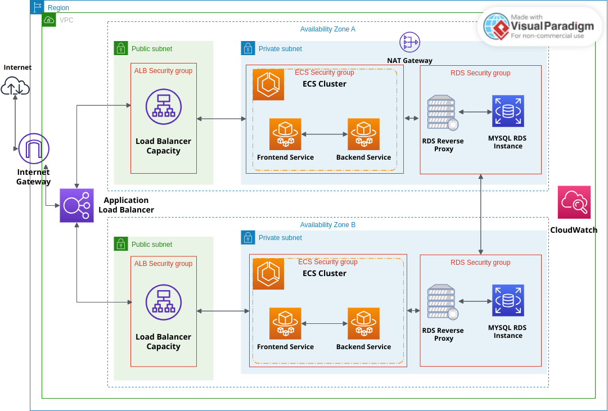

# AWS LAMP Stack Infrastructure with Terraform

This project deploys a modern LAMP (Linux, Apache, MySQL, PHP) stack on AWS using Terraform. The infrastructure is containerized and runs on ECS Fargate with an RDS MySQL database.

## Architecture



## Components

- **VPC**: Isolated network with public and private subnets across 2 AZs
- **ECS Fargate**: Running containerized frontend and backend services
- **RDS MySQL**: Managed database service with proxy for connection management
- **Application Load Balancer**: Routes traffic to frontend (3000) and backend (80)
- **Security Groups**: Controlled access between components

## Prerequisites

1. AWS CLI installed and configured
2. Terraform v1.0.0 or later
3. Docker (for building and pushing images)
4. Access to an AWS account with necessary permissions

## Quick Start

1. **Configure Variables**:
   Create a `terraform.tfvars` file:
   ```hcl
   dbuser     = "your_db_user"
   dbpassword = "your_secure_password"
   ecr_frontend_uri = "your-account.dkr.ecr.eu-west-1.amazonaws.com/lamp-stack-frontend:latest"
   ecr_backend_uri  = "your-account.dkr.ecr.eu-west-1.amazonaws.com/lamp-stack-backend:latest"
   ```

2. **Initialize Terraform**:
   ```bash
   terraform init
   ```

3. **Deploy Infrastructure**:
   ```bash
   terraform plan
   terraform apply
   ```

## Infrastructure Details

### Networking
- VPC CIDR: 172.16.0.0/16
- Public Subnets: 172.16.1.0/24, 172.16.2.0/24
- Private Subnets: 172.16.3.0/24, 172.16.4.0/24
- NAT Gateway for private subnet internet access

### Security
- ALB Security Group: Allows inbound traffic on ports 80 and 3000
- ECS Security Group: Allows inbound traffic from ALB
- RDS Security Group: Allows inbound MySQL (3306) from ECS tasks

### Database
- Engine: MySQL 8.0
- Instance Class: Configurable via variables
- Storage: 20GB GP2
- Credentials managed via AWS Secrets Manager

### Containers
- Frontend: Node.js application on port 3000
- Backend: PHP application on port 80
- Both running on Fargate with auto-scaling capabilities

## Environment Variables

### Frontend Container
- `NEXT_PUBLIC_API_BASE_URL`: Points to ALB DNS name

### Backend Container
- `DB_HOST`: RDS proxy endpoint
- `DB_NAME`: Database name
- `DB_USER`: Database username
- `DB_PASSWORD`: Database password

## Maintenance

### Updating Database Password
1. Update the password in `terraform.tfvars`
2. Run `terraform apply`

### Updating Container Images
1. Push new images to ECR
2. Update the image tags in `terraform.tfvars`
3. Run `terraform apply`

## Clean Up

To destroy all resources:
```bash
terraform destroy
```

**Note**: This will delete all resources including the database. Make sure to backup any important data before destroying the infrastructure.
